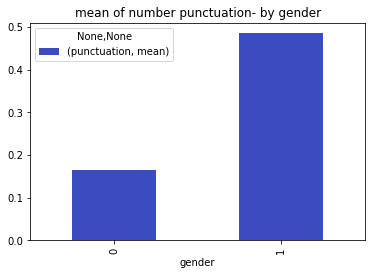
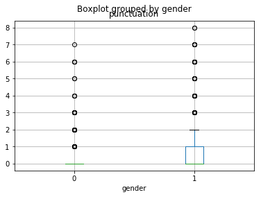

# Models testing with the new sentences


```python
%matplotlib inline
import numpy as np
import pandas as pd
import matplotlib.pyplot as plt
from datetime import date
import sklearn
import itertools
import re
import string
import csv
```

Load train data


```python
#load train data
df = pd.read_csv('C:\\Users\\DELL\\Desktop\\data_scientist\\PROJ1\\d\\y1.txt', sep="\n", header = None, error_bad_lines=False)
df['gender'] = pd.read_csv('C:\\Users\\DELL\\Desktop\\data_scientist\\PROJ1\\d\\y2.txt', sep="\n", header = None, error_bad_lines=False)
df.columns = ['message', 'gender']

#get 5000 instances from each gender
df1 = df[df.gender == 0].sample(5000, random_state=43)
df2 = df[df.gender == 1].sample(5000, random_state=43)
```

    b'Skipping line 3570: expected 1 fields, saw 2\nSkipping line 3573: expected 1 fields, saw 2\nSkipping line 3582: expected 1 fields, saw 2\nSkipping line 3642: expected 1 fields, saw 2\nSkipping line 3682: expected 1 fields, saw 2\nSkipping line 3796: expected 1 fields, saw 2\nSkipping line 4172: expected 1 fields, saw 2\nSkipping line 4175: expected 1 fields, saw 2\nSkipping line 4295: expected 1 fields, saw 2\nSkipping line 4695: expected 1 fields, saw 2\nSkipping line 4769: expected 1 fields, saw 2\nSkipping line 4906: expected 1 fields, saw 2\nSkipping line 4964: expected 1 fields, saw 2\nSkipping line 5231: expected 1 fields, saw 2\nSkipping line 5317: expected 1 fields, saw 2\nSkipping line 5345: expected 1 fields, saw 2\nSkipping line 5661: expected 1 fields, saw 2\nSkipping line 5721: expected 1 fields, saw 2\nSkipping line 5730: expected 1 fields, saw 2\nSkipping line 5867: expected 1 fields, saw 2\nSkipping line 5888: expected 1 fields, saw 2\nSkipping line 5915: expected 1 fields, saw 2\nSkipping line 6031: expected 1 fields, saw 2\nSkipping line 6171: expected 1 fields, saw 2\nSkipping line 6208: expected 1 fields, saw 2\nSkipping line 6255: expected 1 fields, saw 2\nSkipping line 6869: expected 1 fields, saw 2\nSkipping line 6939: expected 1 fields, saw 2\nSkipping line 7045: expected 1 fields, saw 2\nSkipping line 7335: expected 1 fields, saw 2\nSkipping line 7620: expected 1 fields, saw 2\nSkipping line 7696: expected 1 fields, saw 2\nSkipping line 7731: expected 1 fields, saw 2\nSkipping line 8196: expected 1 fields, saw 2\nSkipping line 8201: expected 1 fields, saw 2\nSkipping line 8211: expected 1 fields, saw 2\nSkipping line 8240: expected 1 fields, saw 2\nSkipping line 8392: expected 1 fields, saw 2\nSkipping line 9043: expected 1 fields, saw 2\nSkipping line 9403: expected 1 fields, saw 2\nSkipping line 9648: expected 1 fields, saw 2\nSkipping line 9691: expected 1 fields, saw 2\nSkipping line 10205: expected 1 fields, saw 2\nSkipping line 10273: expected 1 fields, saw 2\nSkipping line 10706: expected 1 fields, saw 3\nSkipping line 10780: expected 1 fields, saw 2\nSkipping line 10846: expected 1 fields, saw 2\nSkipping line 11297: expected 1 fields, saw 2\nSkipping line 11522: expected 1 fields, saw 2\n'
    

Load test data


```python
#load test data
df_testf = pd.read_csv('C:/Users/DELL/Desktop/data_scientist/rnn/ff_new.txt', sep="\n", header = None, error_bad_lines=False)
df_testf['gender']= 1
df_testf.columns=['message', 'gender']

df_testm = pd.read_csv('C:/Users/DELL/Desktop/data_scientist/rnn/mm_new.txt', sep="\n", header = None, error_bad_lines=False)
df_testm['gender']= 0
df_testm.columns=['message', 'gender']
```

Examples of new sentences </br>
female:


```python
print(df_testf.head().message)
```

    0    סידורים באוכל הערב הייתה לה כי בסגנון
    1                                  כזה אני                                   
    2                              תקראו לעשות
    3                            עייפה ויכולתי
    4         חחחחח 5 רק אחיות לטובה נראה אותך
    Name: message, dtype: object
    

male:


```python
print(df_testm.head().message)
```

    0                  חסר שטעיתי כל לבדוק אני 
    1                                הוא לפתוח
    2                           הביא בסיס באמת
    3             בודק עצבן תענה שמישהי לי סתם
    4    מצד הנחתי חחחח ככה machine מודלים אתם
    Name: message, dtype: object
    


```python
#merge train and test sets
df=pd.concat([df1,df2,df_testm,df_testf])
df.index=range(0,12387)
```

# Text Cleaning
remove punctuation <br>
remove stopwords


```python
# remove punctuation from data
regex = re.compile('[%s]' % re.escape(string.punctuation))
df['message_clean']= df['message'].apply(lambda x: regex.sub('', x))
```


```python
# from collections import Counter
# #creat stop-words - the x most frequent words 
# result=df.message_clean.apply(lambda x: pd.value_counts(x.split(" "))).sum(axis = 0)
# result=result.sort_values(ascending=False)
# stop=result.head(500)
# #remove stop-words
# df['message_clean'] = df['message_clean'].apply(lambda x: ' '.join([word for word in x.split() if word not in (stop)]))
```

# Feature extraction
* number of words in message
* number of sentances in message
* number of punctuation in message
* check suffix ת after אני- eg. אני חושבת
* general emojis
* feminine emojis- hearts, flowers..
* sequences like חחחח 
* topic modeling
* best topic for each example
* tfidf


```python
#word count
df['word_count']=df['message'].apply(lambda x: len(x.split(' '))-1)
reg_line = re.compile('([^.\\n;?!]* *[.\\n;?!]+)[ .\\n;?!]*|[^.\\n;?!]+$')
#sentances count
df['sen_count']=df['message'].apply(lambda x: len(re.findall(reg_line,x)))
#punctuation count
reg = """[\.\!\?\"\-\,\']+"""
df['punctuation']=df['message'].apply(lambda x: len(re.findall(reg, x)))

#suffixs features
regex='(אני+ [א|ב|ג|ד|ה|ו|ז|ח|ט|י|כ|ל|נ|ס|ע|פ|צ|ק|ר|ש|ת]+ת)'
df['suffix']=df['message'].apply(lambda x: len(re.findall(regex,x)))
regex='(אני+ [א|ב|ג|ד|ה|ו|ז|ח|ט|י|כ|ל|נ|ס|ע|פ|צ|ק|ר|ש|ת]+ה)'
df['suffix2']=df['message'].apply(lambda x: len(re.findall(regex,x)))

#emoji features
reg='😀|😃|😄|😁|😆|😅|😂|🤣|☺|😊|😇|🙂|🙃|😉|😌|😍|😘|😔|😞|😒|😏|🤠|🤡|😎|🤓|🤗|🤑|😛|😝|😜|😋|😚|😙|😗|😧|🤥|👾|😦|🤔|👽|😯|🙄|☠|😑|😴|💀|😐|😪|👻|💩|😓|😶|😡|😭|👺|👹|🤤|😠|😤|😥|👿|😈|😢|😩|😫|😰|🤕|🤒|😨|😖|😣|😱|😷|🤧|😳|☹|🙁|😵|🤢|🤐|😲|😕|😟|😮|😬|👍|👌|🖕|🍺|🍻'
reg2='👩‍|❤‍|💋‍|👩|👨‍|❤‍|💋‍|👨|💏|👨‍|❤‍|👨|👩‍|❤‍|👩|💑|💋|💄|♥|❤|💛|💚|💙|💜|💔|💕|🌷|🌹|🌻|🌼|🌸|🌺'
df['emoji']=df['message_clean'].apply(lambda x: len(re.findall(reg,x)))
df['emoji2']=df['message_clean'].apply(lambda x: len(re.findall(reg2,x)))

#sequence features
reg='אאא+|בבב+|גגג+|דדד+|ההה+|ווו+|זזז+|חחח+|טטט+|ייי+|כככ+|ללל+|מממ+|נננ+|ססס+|עעע+|פפפ+|צצצ+|קקק+|ררר+|ששש+|תתת+|םםם+|ףףף+|ךךך+|ץץץ+'
df['sequence']=df['message'].apply(lambda x: len(re.findall(reg,x)))
```

# Topic Modeling
A generative statistical model that allows sets of observations to be explained by unobserved groups that explain why some parts of the data are similar.  
4 topics, min df=10, max df=0.1


```python
from sklearn.feature_extraction.text import CountVectorizer
from sklearn.decomposition import LatentDirichletAllocation
SOME_FIXED_SEED = 42
np.random.seed(SOME_FIXED_SEED)

vectorizer = CountVectorizer(min_df=10, max_df=0.1, encoding="cp1255")
# matrix [doc,term] for each entry number of occurence of term t in doc d
mat = vectorizer.fit_transform(df["message_clean"])
lda = LatentDirichletAllocation(n_topics=4)
## matrix [doc,topic] for each entry probability of topic t in doc d
topics = lda.fit_transform(mat)

df_topics_words = pd.DataFrame()
for i in range(lda.components_.shape[0]):
    k=pd.DataFrame(lda.components_, columns=vectorizer.get_feature_names()).T[i].sort_values(ascending=False).head(100)
    df_topics_words['topic '+str(i)+' words'] = k.index
    df_topics_words['topic '+str(i)+' value'] = k.values
    d=dict(zip(vectorizer.get_feature_names(),map(lambda x: int(x),lda.components_[0])))
    
#create docs-topics df
for i in range(topics.shape[1]):
    df['topic_'+str(i)]=pd.to_numeric(topics.T[i])
    
#best topic for each example
df["topic"] = df[["topic_0", "topic_1", "topic_2", "topic_3"]].idxmax(axis=1)
```

    C:\Users\DELL\Anaconda3\envs\py35\lib\site-packages\sklearn\decomposition\online_lda.py:508: DeprecationWarning: The default value for 'learning_method' will be changed from 'online' to 'batch' in the release 0.20. This warning was introduced in 0.18.
      DeprecationWarning)
    

# Tf-idf


```python
df3=df
from sklearn.feature_extraction.text import TfidfVectorizer
#TfidfVectorizer-Convert a collection of raw documents to a matrix of TF-IDF features
tfidfvectorizer = TfidfVectorizer(analyzer = "word",tokenizer = None, ngram_range=(1,3), max_features = 5000, stop_words = None,min_df=1, use_idf=True)
tfidf_matrix = tfidfvectorizer.fit_transform(df3["message_clean"])
tfidf_matrix = tfidf_matrix.todense()
tfidf_matrix2=tfidf_matrix
tfidf_matrix=np.c_[tfidf_matrix, df3.emoji, df3.emoji2, df3.sequence, df3.suffix2, df3.word_count, df3.sen_count,\
                  df3.punctuation, df3.topic_0, df3.topic_1, df3.topic_2, df3.topic_3, df3.suffix]
```

# Modeling


```python
from sklearn.metrics import confusion_matrix
def plot_confusion_matrix(cm, classes,
                      normalize=False,
                      title='Confusion matrix',
                      cmap=plt.cm.Purples):

    plt.imshow(cm, interpolation='nearest', cmap=cmap)
    plt.title(title)
    plt.colorbar()
    tick_marks = np.arange(len(classes))
    plt.xticks(tick_marks, classes, rotation=45)
    plt.yticks(tick_marks, classes)

    if normalize:
        cm = cm.astype('float') / cm.sum(axis=1)[:, np.newaxis]
        print("Normalized confusion matrix")
    else:
        print('Confusion matrix, without normalization')

    print(cm)

    thresh = cm.max() / 2.
    for i, j in itertools.product(range(cm.shape[0]), range(cm.shape[1])):
        plt.text(j, i, cm[i, j],
                 horizontalalignment="center",
                 color="white" if cm[i, j] > thresh else "black")

    plt.tight_layout()
    plt.ylabel('True label')
    plt.xlabel('Predicted label')
```


```python
#split train, test sets
train_x = tfidf_matrix[0:10000]
train_y = df3["gender"][0:10000]
test_x = tfidf_matrix[10000:]
test_y = df3["gender"][10000:]
```

# Random forest


```python
from sklearn.externals import joblib
#load model
forest = joblib.load('C:\\Users\\DELL\\Desktop\\data_scientist\\rnn\\rf_model1.pkl')
```


```python
from sklearn.ensemble import RandomForestClassifier
from sklearn.metrics import f1_score
# Initialize a Random Forest classifier with 500 trees
forest = RandomForestClassifier(criterion='gini', 
                         n_estimators=500, #The number of trees in the forest
                         min_samples_split=10,
                         min_samples_leaf=1,
                         max_features='auto',
                         oob_score=True,
                         random_state=1,
                         n_jobs=-1)

# Fit the forest to the training set, using the bag of words as 
# features and the gender labels as the response variable
forest = forest.fit( train_x, train_y )
# save the model
joblib.dump(forest, 'C:\\Users\\DELL\\Desktop\\data_scientist\\rnn\\rf_model1.pkl') 
```


```python
# Evaluate accuracy best on the test set
score_rf=forest.score(test_x,test_y)
print(score_rf)
```

    0.713028906577
    


```python
from sklearn.metrics import classification_report
results=forest.predict(test_x)

#precision_recall_fscore_support
c_report=classification_report(test_y,results)
print(c_report)
```

                 precision    recall  f1-score   support
    
              0       0.67      0.83      0.74      1176
              1       0.78      0.60      0.68      1211
    
    avg / total       0.73      0.71      0.71      2387
    
    


```python
#print the confusion matrix
c_matrix=confusion_matrix(test_y,results)   
classes=df3.gender.unique()
np.set_printoptions(precision=2)

# Plot non-normalized confusion matrix
plt.figure()
plot_confusion_matrix(c_matrix, classes,
                      title='Confusion matrix, without normalization')

# Plot normalized confusion matrix
plt.figure()
plot_confusion_matrix(c_matrix, classes, normalize=True,
                      title='Normalized confusion matrix')

plt.show()

```

    Confusion matrix, without normalization
    [[975 201]
     [484 727]]
    Normalized confusion matrix
    [[ 0.83  0.17]
     [ 0.4   0.6 ]]
    








# GradientBoosting


```python
GradientBoosting = joblib.load('C:\\Users\\DELL\\Desktop\\data_scientist\\rnn\\gb_model1.pkl')
```


```python
from sklearn.ensemble import GradientBoostingClassifier
GradientBoosting = GradientBoostingClassifier(max_depth=7, max_features=0.35000000000000003, min_samples_leaf=6, min_samples_split=13, n_estimators=100)
GradientBoosting.fit(train_x, train_y)

# save the model
joblib.dump(GradientBoosting, 'C:\\Users\\DELL\\Desktop\\data_scientist\\rnn\\gb_model1.pkl')
```


```python
# Evaluate accuracy best on the test set
score_GB=GradientBoosting.score(test_x,test_y)
score_GB
```


    0.68705488060326769


# LogisticRegression


```python
LR=sklearn.linear_model.LogisticRegression(penalty='l2')
LR.fit(train_x, train_y)
```


    LogisticRegression(C=1.0, class_weight=None, dual=False, fit_intercept=True,
              intercept_scaling=1, max_iter=100, multi_class='ovr', n_jobs=1,
              penalty='l2', random_state=None, solver='liblinear', tol=0.0001,
              verbose=0, warm_start=False)


```python
score_LR=LR.score(test_x,test_y)
score_LR
```


    0.79681608713866781


```python
resultsLR=LR.predict(test_x)
c_reportLR=classification_report(test_y,resultsLR)
print(c_reportLR)
```

                 precision    recall  f1-score   support
    
              0       0.74      0.90      0.81      1176
              1       0.88      0.70      0.78      1211
    
    avg / total       0.81      0.80      0.79      2387
    
    


```python
c_matrixLR=confusion_matrix(test_y,resultsLR)   
classes=df3.gender.unique()
np.set_printoptions(precision=2)

# Plot non-normalized confusion matrix
plt.figure()
plot_confusion_matrix(c_matrixLR, classes,
                      title='Confusion matrix, without normalization')

# Plot normalized confusion matrix
plt.figure()
plot_confusion_matrix(c_matrixLR, classes, normalize=True,
                      title='Normalized confusion matrix')

plt.show()
```

    Confusion matrix, without normalization
    [[1057  119]
     [ 366  845]]
    Normalized confusion matrix
    [[ 0.9  0.1]
     [ 0.3  0.7]]
    


# Results


```python
print('scores')
res=pd.DataFrame([[score_rf,score_LR,score_GB]],columns=['RandomForest',\
                     'LogisticRegression','GradientBoosting']).T.sort(columns=0,ascending=0)
print(res)
```

    scores
                               0
    LogisticRegression  0.796816
    RandomForest        0.713029
    GradientBoosting    0.687055
    

    C:\Users\DELL\Anaconda3\envs\py35\lib\site-packages\ipykernel\__main__.py:2: FutureWarning: sort(columns=....) is deprecated, use sort_values(by=.....)
      from ipykernel import kernelapp as app
    


```python
res.plot(kind='bar', stacked=False, grid=False, legend=False)
```


    <matplotlib.axes._subplots.AxesSubplot at 0x27f022fa198>


# Try only with tf-idf


```python
#split train, test sets
train_x = tfidf_matrix2[0:10000]
train_y = df3["gender"][0:10000]
test_x = tfidf_matrix2[10000:]
test_y = df3["gender"][10000:]
```

# Random forest


```python
from sklearn.externals import joblib
#load model
forest = joblib.load('C:\\Users\\DELL\\Desktop\\data_scientist\\rnn\\rf_model_tfidf.pkl')
```


```python
from sklearn.ensemble import RandomForestClassifier
from sklearn.metrics import f1_score
# Initialize a Random Forest classifier with 500 trees
forest = RandomForestClassifier(criterion='gini', 
                         n_estimators=500, #The number of trees in the forest
                         min_samples_split=10,
                         min_samples_leaf=1,
                         max_features='auto',
                         oob_score=True,
                         random_state=1,
                         n_jobs=-1)

# Fit the forest to the training set, using the bag of words as 
# features and the gender labels as the response variable
forest = forest.fit( train_x, train_y )
# save the model
joblib.dump(forest, 'C:\\Users\\DELL\\Desktop\\data_scientist\\rnn\\rf_model_tfidf.pkl') 
```


```python
# Evaluate accuracy best on the test set
score_rf=forest.score(test_x,test_y)
print(score_rf)
```

    0.75073313783
    


```python
from sklearn.metrics import classification_report
results=forest.predict(test_x)

#precision_recall_fscore_support
c_report=classification_report(test_y,results)
print(c_report)
```

                 precision    recall  f1-score   support
    
              0       0.76      0.72      0.74      1176
              1       0.74      0.78      0.76      1211
    
    avg / total       0.75      0.75      0.75      2387
    
    


```python
#print the confusion matrix
c_matrix=confusion_matrix(test_y,results)   
classes=df3.gender.unique()
np.set_printoptions(precision=2)

# Plot non-normalized confusion matrix
plt.figure()
plot_confusion_matrix(c_matrix, classes,
                      title='Confusion matrix, without normalization')

# Plot normalized confusion matrix
plt.figure()
plot_confusion_matrix(c_matrix, classes, normalize=True,
                      title='Normalized confusion matrix')

plt.show()

```

    Confusion matrix, without normalization
    [[846 330]
     [265 946]]
    Normalized confusion matrix
    [[ 0.72  0.28]
     [ 0.22  0.78]]
    


# GradientBoosting


```python
GradientBoosting = joblib.load('C:\\Users\\DELL\\Desktop\\data_scientist\\rnn\\gb_model_tfidf.pkl')
```


```python
from sklearn.ensemble import GradientBoostingClassifier
GradientBoosting = GradientBoostingClassifier(max_depth=7, max_features=0.35000000000000003, min_samples_leaf=6, min_samples_split=13, n_estimators=100)
GradientBoosting.fit(train_x, train_y)

# save the model
joblib.dump(GradientBoosting, 'C:\\Users\\DELL\\Desktop\\data_scientist\\rnn\\gb_model_tfidf.pkl')
```


```python
# Evaluate accuracy best on the test set
score_GB=GradientBoosting.score(test_x,test_y)
score_GB
```


    0.69962295768747385


# LogisticRegression


```python
LR=sklearn.linear_model.LogisticRegression(penalty='l2')
LR.fit(train_x, train_y)
```


    LogisticRegression(C=1.0, class_weight=None, dual=False, fit_intercept=True,
              intercept_scaling=1, max_iter=100, multi_class='ovr', n_jobs=1,
              penalty='l2', random_state=None, solver='liblinear', tol=0.0001,
              verbose=0, warm_start=False)


```python
score_LR=LR.score(test_x,test_y)
score_LR
```


    0.84792626728110598


```python
resultsLR=LR.predict(test_x)
c_reportLR=classification_report(test_y,resultsLR)
print(c_reportLR)
```

                 precision    recall  f1-score   support
    
              0       0.84      0.86      0.85      1176
              1       0.86      0.84      0.85      1211
    
    avg / total       0.85      0.85      0.85      2387
    
    


```python
c_matrixLR=confusion_matrix(test_y,resultsLR)   
classes=df3.gender.unique()
np.set_printoptions(precision=2)

# Plot non-normalized confusion matrix
plt.figure()
plot_confusion_matrix(c_matrixLR, classes,
                      title='Confusion matrix, without normalization')

# Plot normalized confusion matrix
plt.figure()
plot_confusion_matrix(c_matrixLR, classes, normalize=True,
                      title='Normalized confusion matrix')

plt.show()
```

    Confusion matrix, without normalization
    [[1011  165]
     [ 198 1013]]
    Normalized confusion matrix
    [[ 0.86  0.14]
     [ 0.16  0.84]]
    


# Results


```python
print('scores')
res=pd.DataFrame([[score_rf,score_LR,score_GB]],columns=['RandomForest',\
                     'LogisticRegression','GradientBoosting']).T.sort(columns=0,ascending=0)
print(res)
```

    scores
                               0
    LogisticRegression  0.847926
    RandomForest        0.750733
    GradientBoosting    0.699623
    

    C:\Users\DELL\Anaconda3\envs\py35\lib\site-packages\ipykernel\__main__.py:2: FutureWarning: sort(columns=....) is deprecated, use sort_values(by=.....)
      from ipykernel import kernelapp as app
    


```python
res.plot(kind='bar', stacked=False, grid=False, legend=False)
```


    <matplotlib.axes._subplots.AxesSubplot at 0x27eef3d4048>


# Summery
### part1
1. Data Collection- Collect messages from whatsapp. Data Selection Consider what data is available, what data is missing and what data can be removed.
2. Preprocessing- Data Cleaning, Data Preprocessing Organize your selected data by formatting, cleaning and sampling from it.

###  part2
1. Data Analysis with virtualization- is a process of inspecting, cleansing, transforming, and modeling data with the goal of discovering useful information and suggesting conclusions.
2. Feature extraction from an initial set of measured data and builds derived values (features) intended to be informative and non-redundant. we used many features and used with bad of words models like tfidf and topic modeling.
3. Features Selection- It is the selection of attributes in your data that are most relevant to the predictive modeling problem you are working on.
4. Models Traning

###  part3
1. Build rnn model
2. Generate new sequences, new messages for each gender.

### part4
1. Test the models with new sequences(rnn results)  

# Conclusions
1. Preprocessing phase is very crucial to accurate classification model training!
2. According to the results of the model we can see that with the features we created can be classified well between the messages and the types of each species.
3. To improve the neural network model, we need to train it longer and work with more data- More time is better, More data is better.
4. The model with the highest accuracy is Logistic regressing Model(0.847926).

# Problems
1. There are no free text processing tools like Stemming which support the Hebrew language
2. There is no good sets of stopwords.
